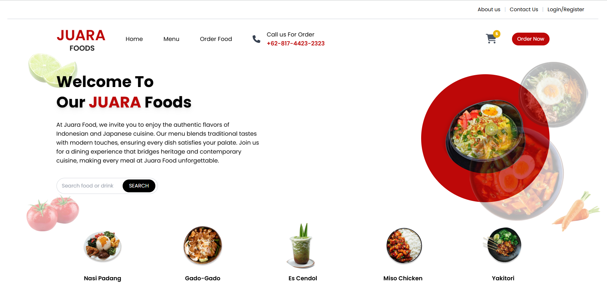

# 🍱 Juara Foods: Taste the Heritage
[](https://tailwindcss.com)
[](https://www.uksw.edu/)
[](https://developer.mozilla.org/en-US/docs/Web/JavaScript)

**Juara Foods** adalah platform UMKM kuliner modern yang menjembatani kelezatan autentik masakan tradisional Indonesia dengan seni kuliner Jepang. Website ini dirancang untuk memberikan pengalaman pemesanan makanan yang mulus, interaktif, dan visual yang menggugah selera bagi pelanggan.

---

## 📸 Desktop Interface Showcase
Berikut adalah pratinjau antarmuka utama **Juara Foods** yang dioptimalkan untuk pengalaman pengguna di perangkat desktop.




---

## 🚀 Fitur Utama
**Hero Section Interaktif**: Beranda dinamis dengan slogan "Welcome to Our JUARA Foods" dan elemen dekoratif lemon, tomat, serta wortel yang menarik.
*Katalog Menu Multi-Kategori**: Filter menu yang memisahkan masakan Indonesia (Soto Banjar, Rendang), Jepang (Sushi, Karaage), dan Minuman secara real-time.
**Sistem Keranjang & Detail Produk**: Halaman detail menu (Miso Chicken) lengkap dengan penilaian ulasan, harga Rp 20.000, serta manajemen jumlah pesanan.
**Proses Pembayaran (Checkout)**: Simulasi transaksi yang mencakup detail pengiriman (Juara Foods Delivery atau Self Pickup) serta metode pembayaran seperti ShopeePay, OVO, dan GoPay.
**Dashboard Admin**: Panel administrasi terintegrasi untuk pengelolaan operasional website secara efisien

---

## 🛠️ Teknologi yang Digunakan
Website ini dibangun dengan kombinasi teknologi modern untuk memastikan performa maksimal:
**Frontend**: HTML5 dan Tailwind CSS untuk desain yang bersih dan responsif.
**Animasi**: AOS.js (Animate On Scroll) untuk memberikan efek transisi visual saat menjelajahi halaman.
**Ikonografi**: FontAwesome 6 [cite: 1424] [cite_start]dan Google Fonts (Poppins) untuk estetika tipografi yang modern.
**Interaktivitas**: JavaScript kustom untuk menangani logika menu dan komponen UI.

---

## 📂 Struktur Proyek
```text
Juara-Foods/
├── assets/             # Dokumentasi gambar, icon, dan file CSS/JS 
├── pages/              # Halaman About, Contact, dan Menu
│   ├── auth/           # Halaman Login & Register 
│   └── ...
├── index.html          # Gerbang utama (Landing Page)
├── tailwind.config.js  # Konfigurasi kustomisasi warna dan tema Tailwind
└── README.md           # Dokumentasi teknis proyek
